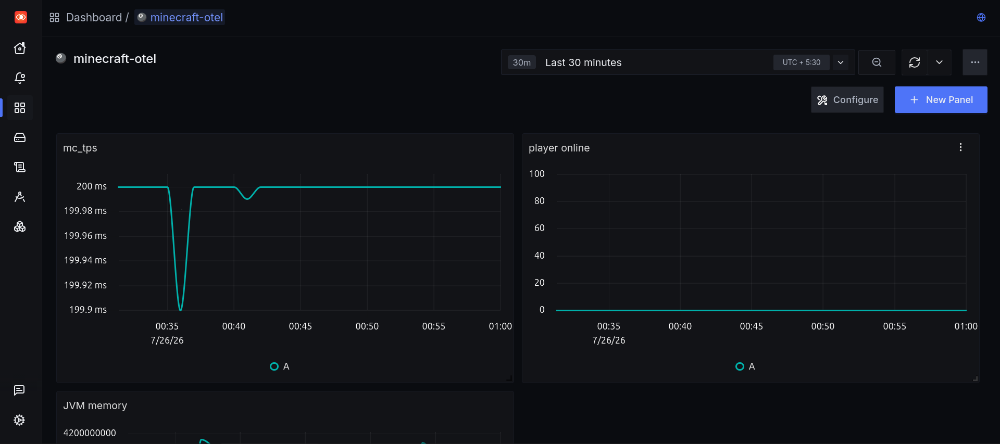
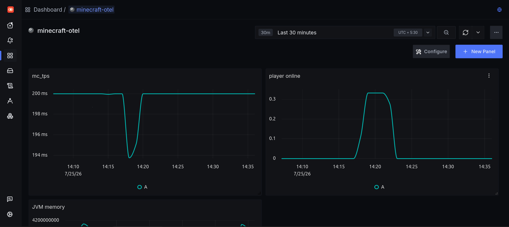
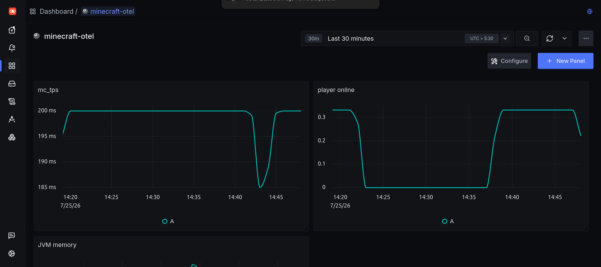
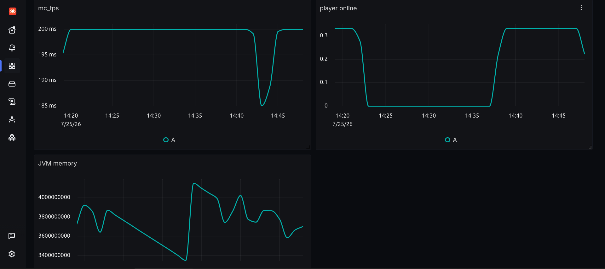

# Minecraft Server Observability with SigNoz

Instrumenting a self-hosted Paper Minecraft server with [SigNoz](https://signoz.io) to get real-time visibility into server health — TPS, player load, JVM memory, and logs — all in one place, with automated alerting.

Built for the WeMakeDevs x SigNoz "Agents of SigNoz" hackathon (Track 03: Build Your Own).

## Why

I run a Paper Minecraft server for friends on an old laptop. When it lagged, I had no way to know why — no metrics, no logs in one place, just guesswork. This project turns that black box into something observable: a real dashboard, real alerts, and a real incident caught in the act.

## Architecture

```
Paper Minecraft Server (JVM)
   │
   ├── minecraft-prometheus-exporter plugin
   │     exposes /metrics on :9940
   │     (mc_tps, mc_players_online_total, mc_jvm_memory)
   │
   └── logs/latest.log
         (join/leave, warnings, errors)
              │
              ▼
   OpenTelemetry Collector (Docker)
   ├── prometheus receiver  → scrapes :9940 every 10s
   ├── filelog receiver     → tails latest.log
   └── otlp exporter        → forwards metrics + logs to SigNoz
              │
              ▼
   SigNoz (self-hosted via Foundry)
   ├── Dashboard: TPS / Players Online / JVM Memory
   └── Alert: mc_tps < 15 for 1+ minute
```

## Components

| Component | Role |
|---|---|
| [sladkoff/minecraft-prometheus-exporter](https://github.com/sladkoff/minecraft-prometheus-exporter) | Paper plugin exposing TPS, player count, and JVM memory as Prometheus metrics |
| OpenTelemetry Collector (`otel/opentelemetry-collector-contrib`) | Scrapes the plugin's metrics endpoint and tails server logs, forwards both to SigNoz via OTLP |
| SigNoz | Unified backend for metrics + logs, dashboarding, and alerting |
| SigNoz Foundry | Declarative, reproducible SigNoz deployment (`casting.yaml`) |

## Reproducing this setup

### 1. Deploy SigNoz via Foundry

```bash
curl -fsSL https://signoz.io/install-foundry.sh | bash
foundryctl cast -f casting.yaml
```
This validates prerequisites, generates the deployment files, and starts SigNoz. Once up, the UI is at `http://localhost:8080`, with OTLP ingestion on `4317` (gRPC) / `4318` (HTTP).

### 2. Install the metrics plugin on your Paper server

Download the latest release of [minecraft-prometheus-exporter](https://github.com/sladkoff/minecraft-prometheus-exporter/releases) into your server's `plugins/` folder and restart the server.

**Important:** by default the exporter may bind to `127.0.0.1` only. If your OTel Collector runs in Docker, edit the plugin's config to bind `0.0.0.0` instead, or the collector won't be able to reach it.

Verify it's working:
```bash
curl http://localhost:9940/metrics
```

### 3. Run the OpenTelemetry Collector

Edit `otel-collector-config.yaml` in this repo:
- Update the `filelog` receiver's `include` path to your server's actual `logs/latest.log` path
- Confirm the `prometheus` receiver's target matches your exporter's host/port

Then run:
```bash
docker run -d --name mc-otel-collector \
  --add-host=host.docker.internal:host-gateway \
  -v "$(pwd)/otel-collector-config.yaml:/etc/otelcol-contrib/config.yaml" \
  -v "/path/to/your/server/logs:/path/to/your/server/logs:ro" \
  otel/opentelemetry-collector-contrib:latest
```

**If you're running a firewall (e.g. `ufw`)**, make sure Docker's bridge network is allowed to reach the exporter's port:
```bash
docker network inspect bridge | grep Subnet
sudo ufw allow from <that-subnet> to any port 9940 proto tcp
```

### 4. Build the dashboard in SigNoz

Create a dashboard with three panels:
- **TPS over time** — metric `mc_tps`
- **Players online** — metric `mc_players_online_total`, summed across the `world` label
- **JVM memory** — metric `mc_jvm_memory`, grouped by `type` label (`used`/`free`/`max`)

### 5. Set the alert

Alerts → New Alert Rule → Metric-based:
- Metric: `mc_tps`
- Condition: `< 15` for 1+ minute
- Notification channel of your choice

## Validating under real load

To confirm the pipeline actually catches incidents (not just idle baselines), I intentionally tanked server performance by detonating thousands of TNT at once — spiking entity physics, block updates, and GC pressure simultaneously. The dashboard captured the TPS crash and recovery in real time, and the alert fired as configured.

**Steady state** (baseline, no load):


**Under stress** (TNT detonation — TPS dip, player-count signal drop, and correlated JVM memory swing):




See the demo video for this in action: **[YouTube link]**

## What I ran into

- The metrics plugin defaulted to binding `127.0.0.1`, which is invisible to a container even with `--network host` in some Docker setups — had to explicitly rebind it to `0.0.0.0`
- `--network host` didn't reliably reach the loopback interface under this machine's Docker setup — switched to `host.docker.internal` with `--add-host=host.docker.internal:host-gateway`
- `ufw` was silently blocking Docker's bridge network from reaching the exporter's port even after the bind fix — had to explicitly allow the bridge subnet

## Repo contents

- `otel-collector-config.yaml` — Collector config (Prometheus scrape + log tailing + OTLP export)
- `casting.yaml` / `casting.yaml.lock` — Foundry deployment config for reproducing the SigNoz install
- `screenshots/` — Dashboard views (steady-state and during the TNT stress test)